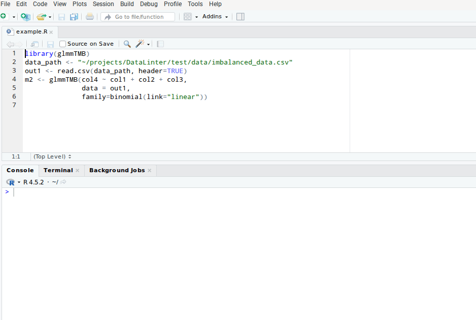

# RStudio Add-in for DataLinter

[](LICENSE)
[](https://www.r-project.org/)

**An RStudio add-in that brings the power of [DataLinter](https://github.com/zgornel/DataLinter) directly into your RStudio session.**

DataLinter performs automated sanity checks and linting on data frames and modelling code (23 built-in linters covering missing values, outliers, type consistency, modelling assumptions, and more). This add-in lets you lint selected code (and optional data) with a single click from the **Addins** menu.



## Table of Contents
- [Features](#features)
- [Prerequisites](#prerequisites)
- [Installation](#installation)
- [Quick Start](#quick-start)
- [Troubleshooting](#troubleshooting)
- [Contributing](#contributing)
- [License](#license)
- [Acknowledgements](#acknowledgements)
- [References](#references)

## Features
- Lint any selected R code directly from the editor.
- Automatically detects `data = my_variable` arguments and sends the data frame to the linter.
- Falls back to a global `LINTER_DATA` variable when no `data=` argument is present.
- Real-time feedback inside RStudio (via the add-in UI powered by `rstudioapi`).
- Zero-configuration integration with the official DataLinter Docker server.

See the full [DataLinter documentation](https://zgornel.github.io/DataLinter/dev/) for details on the 23 linters and configuration options.


## Prerequisites
- **R** ≥ 4.0 (tested with imports: `rstudioapi`, `httr`, `rjson`, `tuple`)
- **RStudio** (Desktop or Server) with the Addins menu enabled
- **Docker** (recommended and documented deployment for DataLinter)
- Up-to-date `pak` or `devtools` + `rstudioapi`

## Installation

### 1. DataLinter server (Docker)
```bash
docker pull ghcr.io/zgornel/datalinter-compiled:latest
```

### 2. RStudio-addin package

> Note: Make sure you have up-to-date stable versions of [devtools](https://github.com/hadley/devtools) or [pak](https://pak.r-lib.org/) and [rstudioapi](https://github.com/rstudio/rstudioapi/) installed before installing the package.

```r
# Recommended (fast & dependency-aware)
pak::pak("zgornel/Rstudio-Addin-DataLinter")

# Alternative
devtools::install_github("zgornel/Rstudio-Addin-DataLinter")
```
After installation the add-in appears automatically under **Addins → DATALINTER**.


## Quick Start
1. Start the DataLinter server (see [below](#starting-the-datalinter-server)
2. In RStudio, define sample data under the `LINTER_DATA` variable:
```r
LINTER_DATA <- mtcars   # or any data.frame
```
3. Select any modelling code (or nothing) and choose **Addins → DATALINTER / Lint data and code**.
4. Review the lint report that appears.

### Starting the DataLinter server

The add-in requires the DataLinter server running on port `10000` (default). The server can be started with
```bash
docker run -it --rm -p 10000:10000 \
  ghcr.io/zgornel/datalinter-compiled:latest \
    /datalinterserver/bin/datalinterserver \
      -i 0.0.0.0 \
      --config-path /datalinter/config/r_modelling_config.toml \
      --log-level info
```
If the server starts correctly, it should display something like:
```
[ Info: • Data linting server online @0.0.0.0:10000...
[ Info: Listening on: 0.0.0.0:10000, thread id: 1
```

### How the add-in works
- Selected code is analyzed by the plugin
- If the code contains `data = my_variable`, that object is automatically serialized and included.
- Code and data are sent to the server
- If no code is selected, the plugin looks for a global `LINTER_DATA` variable.
- The plugin waits for an answer from the server and prints when received


## Troubleshooting
- **Server not reachable** → Check Docker is running, port 10000 is free (`docker ps`), and firewall allows `localhost` traffic
- **Port conflict** → Change the published port (`-p 10001:10000`) and update the add-in configuration
- **Large datasets** → DataLinter is designed for typical modelling data; very large objects may need custom work
- **Windows / macOS** → Ensure Docker Desktop is running and “File Sharing” includes your project folders if using volumes
 -**No output** → Verify the server log shows successful connection; try increasing logging level with `--log-level debug`

Report issues via [GitHub Issues](https://github.com/zgornel/Rstudio-Addin-DataLinter/issues/new).


## Contributing

Please [file an issue](https://github.com/zgornel/Rstudio-Addin-DataLinter/issues/new) to report a bug or request a feature. See the parent [DataLinter contributing guidelines](https://github.com/zgornel/DataLinter/blob/master/CONTRIBUTING.md) as well.


## License
This project is licensed under the GNU General Public License v3.0 (GPL-3) – see LICENSE for details. The underlying DataLinter engine uses an MIT license.


## Acknowledgements

The initial version of DataLinter was fully inspired by [this work](https://github.com/brain-research/data-linter) written by Google brain research.


## References

[1] https://en.wikipedia.org/wiki/Lint_(software)

[2] N. Hynes, D. Sculley, M. Terry "The data linter: Lightweight, automated sanity checking for ml data sets", NIPS MLSys Workshop, 2017; [paper](http://learningsys.org/nips17/assets/papers/paper_19.pdf)

[3] The [data-linter](https://github.com/brain-research/data-linter) code repository

